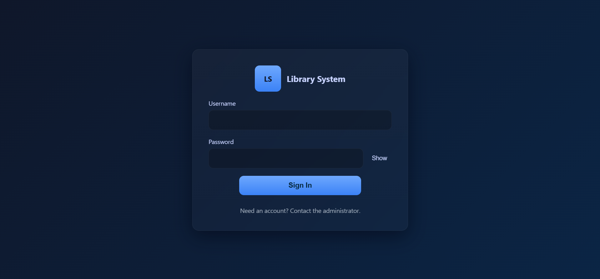
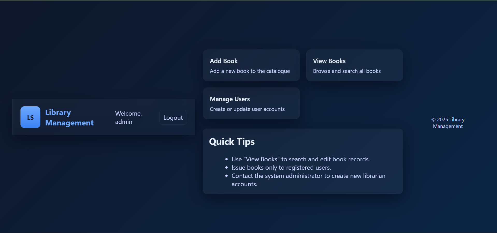
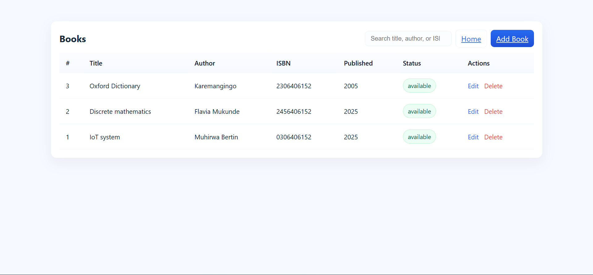
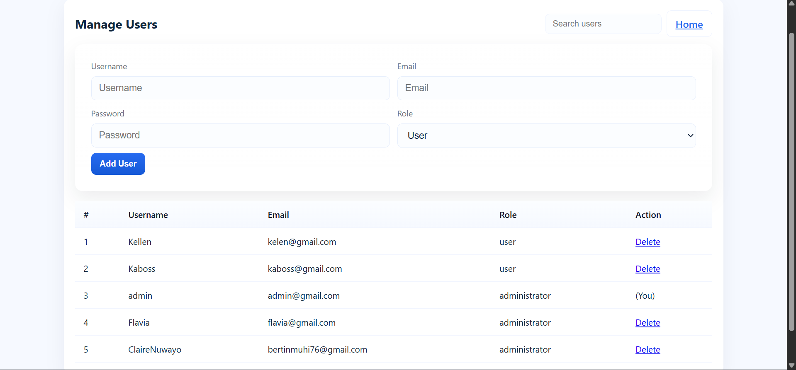

# LibraryManagement-MUHIRWABERTIN-MUKUNDENTEFLAVIA
PHP + MySQL project

## Group Members
1. **Full Name:** MUHIRWA BERTIN 
   **RegNo:** 24RP05971 

2. **Full Name:** MUKUNDENTE FLAVIA  
   **RegNo:** 23RP02457  

---

## 2. Project Title

Library Management System Web Application Using PHP and MySQL

## Project link

http://librarymsystem.atwebpages.com/login.php

- Default Username and Password

- Username : admin
- password : admin

## 3. Project Overview

This project is a Library Management System developed using PHP, MySQL, HTML, and CSS.
The system is designed to help libraries efficiently manage users, books, and borrowing transactions.

The application implements secure authentication, data validation, and database-driven operations while following best practices such as PDO prepared statements and session management.

## 4. Objectives of the System

- To provide a secure login and logout system.

- To manage library users and books efficiently.
- To ensure data integrity through validation and constraints.
- To demonstrate proper backend development using PHP and MySQL.

## 5. Features

- User authentication (Login & Logout).
- User management (Add, View, Update, Delete users).
- Book management (Add, View, Update, Delete books).
- Role-based access control.
- Form data validation with user-friendly messages.
- Clean and simple user interface.

## 6. System Architecture

 ## 6.1 Technologies Used

- Backend: PHP (PDO)
- Database: MySQL / MariaDB
- Frontend: HTML, CSS
- Server: Apache (XAMPP)
- Version Control: Git & GitHub

## 8. Backend Implementation (PHP Requirements)
## 8.1 PDO with Prepared Statements

- All database operations use PDO.
- Named placeholders are used.
- Secure execution to prevent SQL Injection.

## 8.2 Form Data Validation

- Required field validation.
- Email format validation.
- Friendly error and success messages.

## 7. Screenshots

## Login Page

## Dashboard

## Book Management

## User Management

